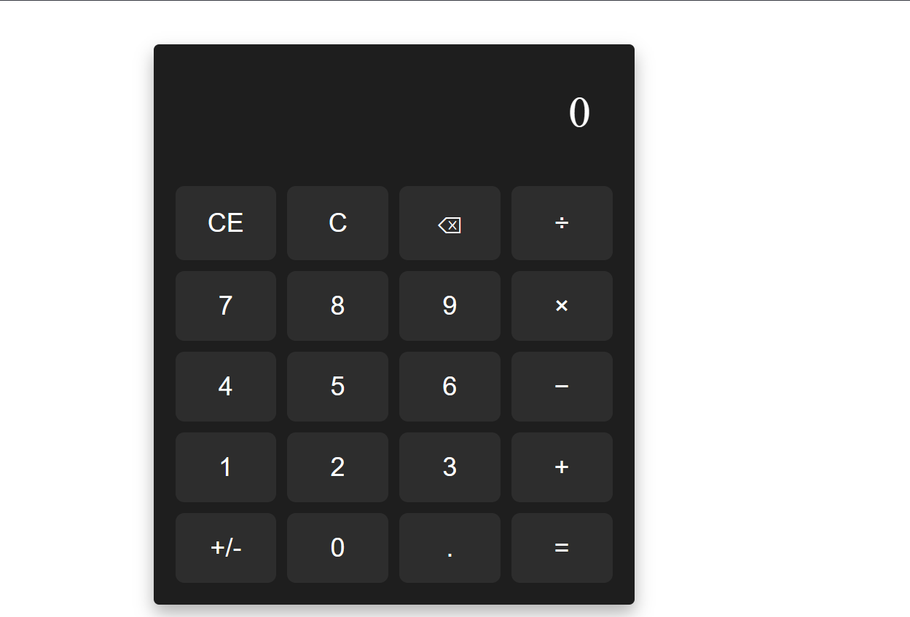

# 🧮 Angular Calculator (Windows Style)

A fully responsive, modern calculator app built using **Angular 16+ with Signals API**.  
The layout and button arrangement are inspired by the default Windows Calculator.



---

## 🚀 Features

- Full support for basic arithmetic operations: `+`, `−`, `×`, `÷`
- Clear Entry (`CE`), All Clear (`C`), Backspace (`⌫`)
- Toggle Sign (`+/-`), Decimal, and Equal buttons
- Real-time reactivity using `signal()` from Angular
- Styled with SCSS to replicate the Windows look

---

## 🛠️ Tech Stack

- **Angular 16+**
- **Angular Signals**
- **TypeScript**
- **SCSS**

---

## ⚙️ Getting Started

### 1. Clone this Repository

```bash
git clone  https://github.com/Clifford537/angular_calculatorproject.git
cd angular_calculatorproject
```

### 2. Install Dependencies

```bash
npm install
```

### 3. Run the App

```bash
ng serve
```

Open your browser and go to:  
**`http://localhost:4200`**

---

## 📁 Project Structure

```
src/
├── app/
│   └── calculator/
│       ├── calculator.component.ts
│       ├── calculator.component.html
│       ├── calculator.component.scss

```

---

## 📄 License

MIT © 2025 Clifford Mukosh
